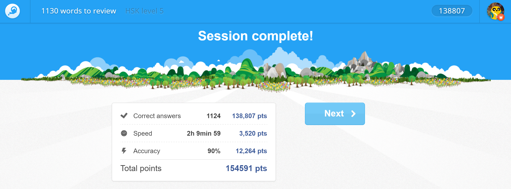
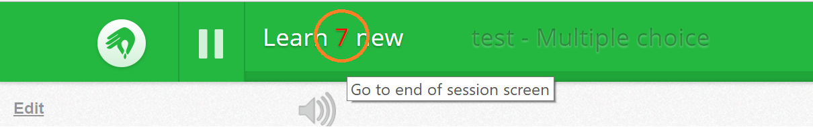

# Memrise Infinite Learning

Causes items to continually be loaded during a learning session. 

For example, as a result you can go far beyond the 100 item limit for a review session:

 

### Installation

The easiest method is through an extension/add-on on chrome/firefox:

- Chrome: install the [Tampermonkey](https://chrome.google.com/webstore/detail/dhdgffkkebhmkfjojejmpbldmpobfkfo) extension
- Firefox: install the [Greasemonkey](https://addons.mozilla.org/en-US/firefox/addon/greasemonkey/) add-on

Then add the script using the following link: https://github.com/cooljingle/memrise-infinite-learning/raw/master/Memrise_Infinite_Learning.user.js

### Usage
With the script enabled the learning session will continue until there is nothing left to review/learn of items relevant to that session. As you approach what would have been the end of session screen you may experience a slight pause as a request is made to get more items to put in. Once this is done the count of words to learn for the session will update accordingly and the session will continue as per normal.

I have added a shortcut to the end of session screen in case you want to end the session prematurely and want to review your stats; to trigger it just click on the the number representing how many items you are learning for the session.

 
